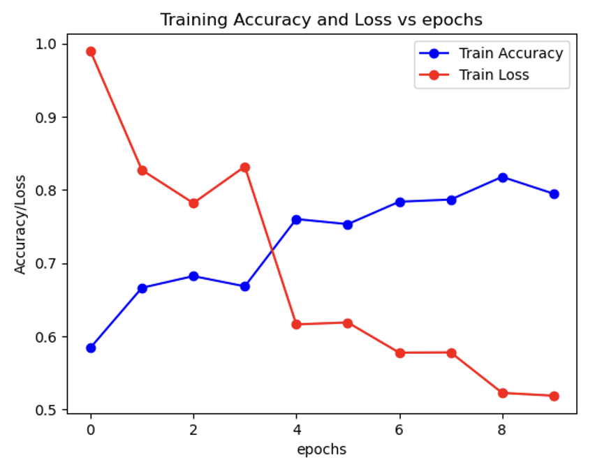

# CNN From Scratch

The code CNN.py builds a CNN model from scratch. The data used for training and testing is the cifar10_data (Source: https://www.cs.toronto.edu/~kriz/cifar.html)  

Following are the 10 classes in the CIFAR dataset:  

For the sake of simplicity, only 4 out of the 10 classes have been used to train and test the data  

### Results

The results from training the code are given in the graph below:

The testing accuracy and loss are 65% and 1.26 respectively